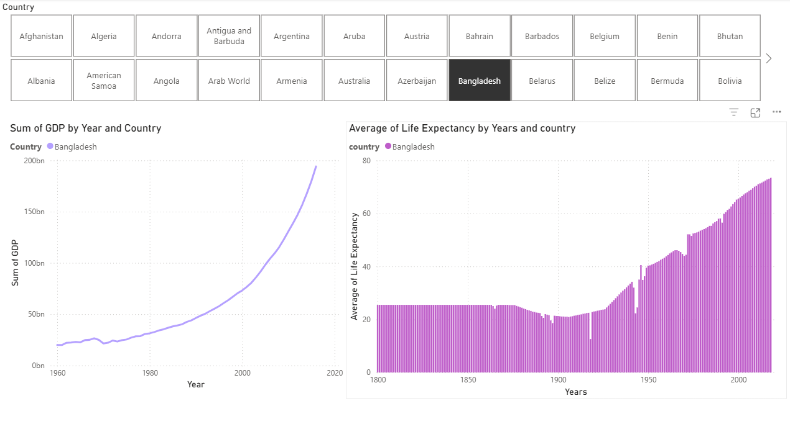

# 📊 Life Expectancy & GDP Dashboard

This Power BI dashboard analyzes global development indicators:

- **Average Life Expectancy** per country, tracked annually
- **Total GDP** per country, aggregated by year
- **Interactive Country Filter**: All visuals respond to country selection

## 🔗 Data Relationships

Tables are linked via the **Country** field, enabling dynamic filtering across visuals.

## 🖼️ Dashboard Preview

