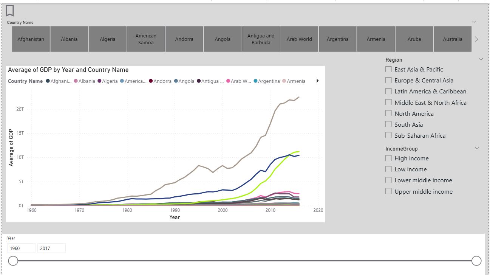
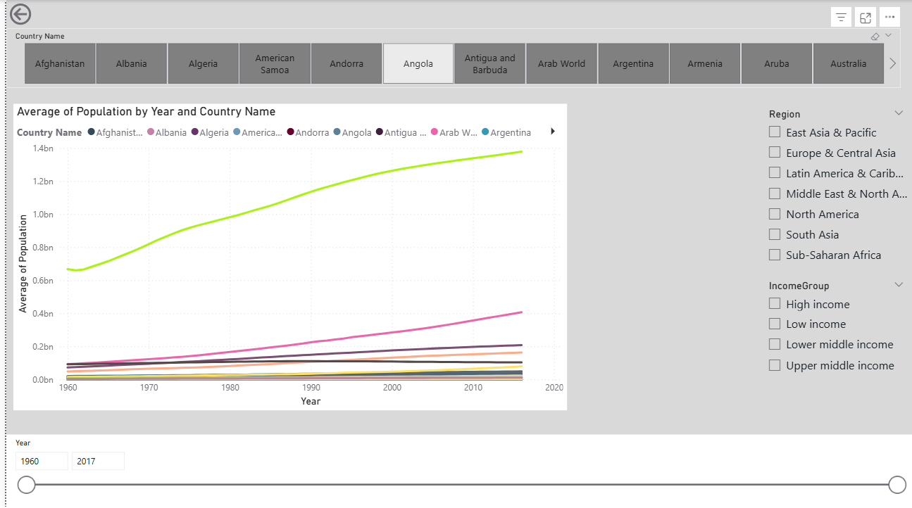
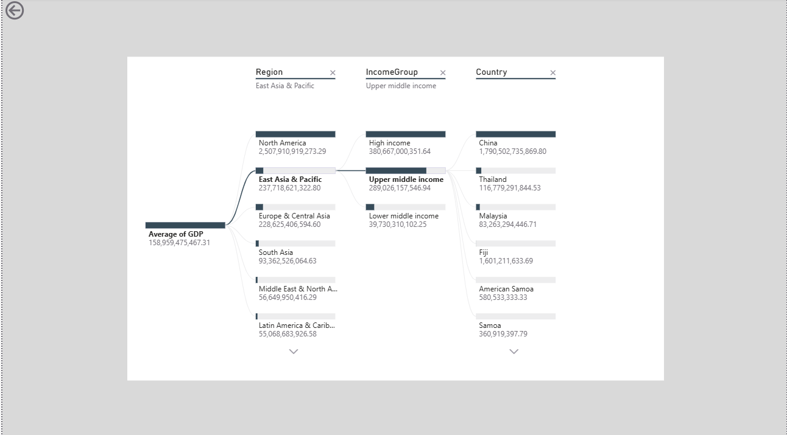
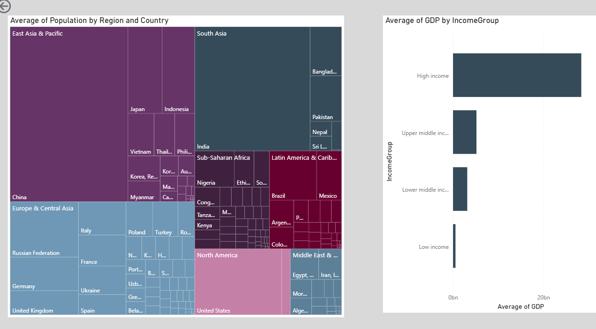
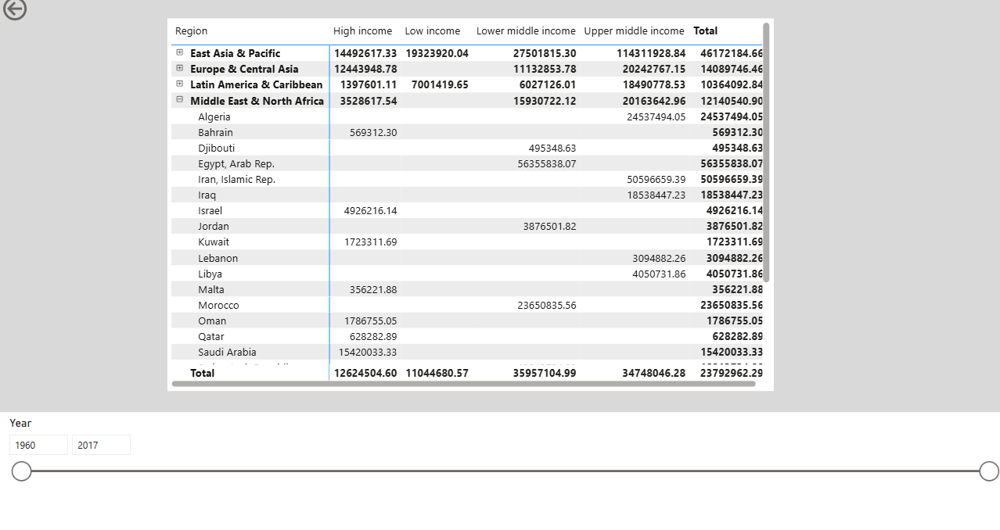

# 📊 GDP & Population Dashboard

This Power BI dashboard analyzes Data from 1960 to 2017 for different countries Population and GDP filtered By income Groups and Regions and Years with different Data Visuals and feautures like Drill Options , interations Buttons and Bookmarks 

## 🔗 Data Relationships

## 🖼️ Dashboard Preview

